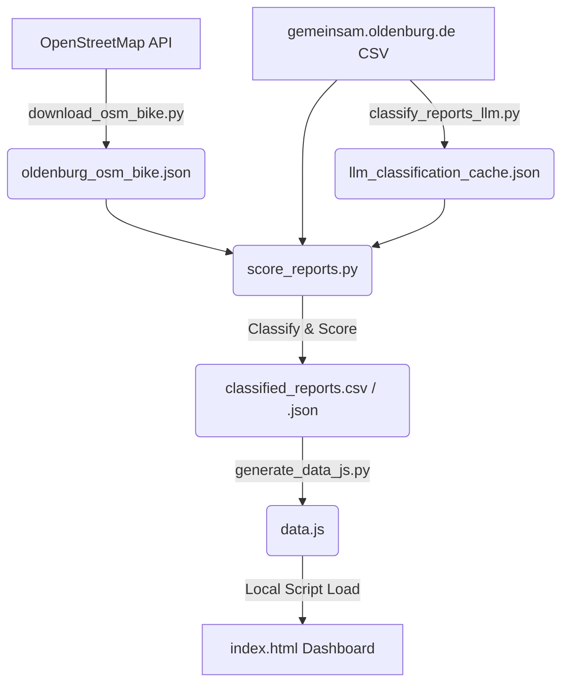

# 🚲 Rad-Verbesserer Oldenburg (Cycling Infrastructure Analyzer)

An interactive dark mode web dashboard and data pipeline that maps, filters, and analyzes citizen infrastructure reports in Oldenburg, Germany against the OpenStreetMap (OSM) cycling network. 

The dashboard provides automated tools for cycling advocacy, including generating weekly newsletter issues (Markdown/HTML) and social media content (Telegram broadcasts, Instagram carousel slide cards).

---

## 🏗️ Architecture & Processing Pipeline

The project follows a 5-step pipeline to extract, project, classify, and visualize the data:



### 1. Cycling Network Extraction
Using the custom Overpass script `download_osm_bike.py`, we extract all cycleways, shared paths, and designated bicycle streets (`bicycle_road=yes`, `cyclestreet=yes`, `highway=cycleway`) within the Oldenburg bounding box.

### 2. High-Precision Coordinate Mapping & Proximity Matching
The raw coordinates in OpenStreetMap and citizen tickets are in degrees (WGS84). Standard distance calculations in degrees are inaccurate. 
* We use `pyproj` to project all coordinates into **UTM Zone 32N (EPSG:32632)**, which provides Cartesian coordinates in **meters**.
* We construct `shapely` `LineString` elements for the cycleways and measure the exact distance in meters from each citizen ticket to the nearest bike segment.

### 3. LLM-Based & Heuristic Classification
Reports are classified using a hybrid model:
*   **LLM Classification (Ground Truth):** Programmatically queries the Google GenAI SDK (using model `gemini-2.5-flash-lite` and strict Pydantic JSON schemas) to determine if a report is cycling-related. It classifies issues into 10 subcategories (e.g. `pothole_damage`, `glass_debris`, `vegetation_block`, `illegal_parking_obstruction`) and provides a short German explanation.
*   **Local Cache:** Classification results are cached locally in `llm_classification_cache.json` to prevent re-querying the API.
*   **Heuristic Fallback (Regex):** For reports that are not cached, a highly optimized regex heuristic runs as a fallback. By using boundary-aware patterns, negation keywords, and allowed overrides, the regex heuristic matches the LLM predictions with **84.45% accuracy** and an **83.96% F1 score**.

### 4. Relevance Scoring System
Tickets are scored ($0$ to $100+$ points) based on their spatial metrics and category matches:
*   **LLM Match (+50 pts):** Confirmed as cycling-related by the LLM (or regex fallback).
*   **LLM Confidence Penalty (-45 pts):** Confined penalty if the LLM confidently marks the report as unrelated, suppressing false positives located close to cycle paths (e.g. general car lanes).
*   **Proximity (+10 to +35 pts):** Within 10m (+35), 25m (+20), or 50m (+10).
*   **Category Relevance (+10 to +50 pts):** *Fundräder/Abandoned bikes* (+50), *Road/Signs/Lighting/Hedges* (+15), *Fallen trees/branches* (+10).
*   **Priority Corridor Bonus (+20 pts):** Located within 50m of an official ADFC priority bicycle corridor.
*   **Status & Age Adjustments (+10 to -20 pts):** Open/Active (+10), Closed (-20), Not Responsible (-15), Older than 180 days (-10).

#### Classification Tiers:
* 🔴 **Confirmed cycling issue (Score &ge; 70):** Direct path blockages, path potholes, or abandoned bikes on paths.
* 🟠 **Likely cycling issue (Score 40-69):** General defects, foliage, or lights out directly on/near cycle paths.
* 🟡 **Possibly affects cyclists (Score 20-39):** Street-level reports near cycleways that might impede visibility or traffic.
* ⚪ **Not cycling-specific (Score < 20):** General road complaints not directly related to cycling infrastructure.

### 5. Interactive Premium Web Dashboard (Zero-CORS)
`generate_data_js.py` compiles the GeoJSON bike network and classified reports into a single unified JavaScript variable file `data.js`. This allows you to run the dashboard locally by opening `index.html` directly in a browser without CORS (Cross-Origin Resource Sharing) local fetch errors.

The dashboard features premium, state-of-the-art interactive upgrades:
*   **Marker Clustering & Custom Pins:** Groups 553 reports with density-responsive custom glass-morphic nodes. Individual pins contain category emoji glyphs (e.g., 🚧, 🧹, 🚦) and spring-inflate on hover.
*   **Smooth Glide & Selection Ripple:** Camera movements are animated using Leaflet's `map.flyTo()`, and the selected marker pulses a glowing ripple halo matching its classification tier.
*   **Slide-Out Details Panel:** Replaces static boxes with a modern sidebar panel that slides in from off-screen right using custom ease-in-out transitions.
*   **Dynamic Density Heatmap Mode:** A floating glassmorphic button toggles a Leaflet heat gradient of report hot-spots, weighting intensities based on confidence scores.
*   **Google Satellite & Street View Context:** Features a mini satellite hybrid imagery iframe previewing coordinate surroundings, alongside Google Maps directions and deep-linked Street View panorama buttons.
*   **Touch-Swipeable Photo Carousel:** Swipe gestures or navigation controls transition horizontally through multiple report photos with indicator dots.
*   **Live Search Bar & Time Filters:** Real-time multi-field text search queries integrated with preset (7d, 30d, 90d) and custom range date picker filters.

---

## 🛠️ Repository File Index

| File | Description |
| :--- | :--- |
| **`index.html`** | Main dashboard structure containing the Leaflet map and Sidebar UI. |
| **`style.css`** | Premium dark mode styling (`#0b0f19`), glassmorphism overlays, custom glowing pins, and swipable card layouts. |
| **`app.js`** | Interactive mapping logic, filter actions, newsletter compilation, and Instagram indicator controller. |
| **`data.js`** | Unified JavaScript file storing the pre-compiled reports and simplified OSM bike network GeoJSON. |
| **`download_osm_bike.py`** | Script to fetch bicycle network geometries from OpenStreetMap Overpass mirrors. |
| **`classify_reports_llm.py`** | Standalone script that uses `google-genai` and `gemini-2.5-flash-lite` to classify reports. |
| **`score_reports.py`** | Core script executing coordinate projections, distance calculations, and scoring using LLM data/regex fallback. |
| **`evaluate_rules.py`** | Diagnostic script measuring regex heuristic performance (Accuracy, Precision, Recall, F1) against LLM labels. |
| **`optimize_regex.py`** | Optimizer utility that performs greedy keyword association search to maximize heuristic alignment with the LLM. |
| **`llm_classification_cache.json`** | Local JSON database storing all processed LLM classifications to reduce API costs. |
| **`stadtverbesserer_snapshot.csv`** | Original dataset of 553 citizen reports from the Oldenburg Gemeinsam platform. |
| **`classified_reports.csv`** | Processed spreadsheet output containing coordinates, distances, scores, and confidence classifications. |
| **`agent_handoff.md`** | Handoff documentation designed for future AI agents to continue development of this project. |

---

## 🚀 Setup & Execution Guide

### Prerequisites
Make sure you have `uv` installed, which handles all script dependencies automatically.

### Running the Dashboard
Since all data is embedded inside `data.js`, you can open the dashboard with zero setup:
1. Double-click the **`index.html`** file in your file explorer.
2. Or run a local lightweight server:
   ```bash
   uv run python -m http.server 8000
   ```
   and navigate to `http://localhost:8000` in your web browser.

### Re-running the Data Pipeline
If you update the dataset or want to update the OSM bike network, run:

1. **Download OSM Bike Network:**
   ```bash
   uv run --with requests download_osm_bike.py
   ```
2. **Perform LLM Classification:**
   ```bash
   export GEMINI_API_KEY="your_api_key_here"
   uv run --with google-genai --with pydantic --with pandas classify_reports_llm.py
   ```
3. **Re-calculate Scores & Classifications:**
   ```bash
   uv run --with pandas --with numpy --with shapely --with pyproj score_reports.py
   ```
4. **Compile Browser Assets:**
   ```bash
   uv run generate_data_js.py
   ```

### Running Rule Evaluation & Diagnostics
To test heuristic rule matches or run keyword optimization, use:
* **Evaluate current rules:** `uv run --with pandas evaluate_rules.py`
* **Optimize regex patterns:** `uv run --with pandas optimize_regex.py`

