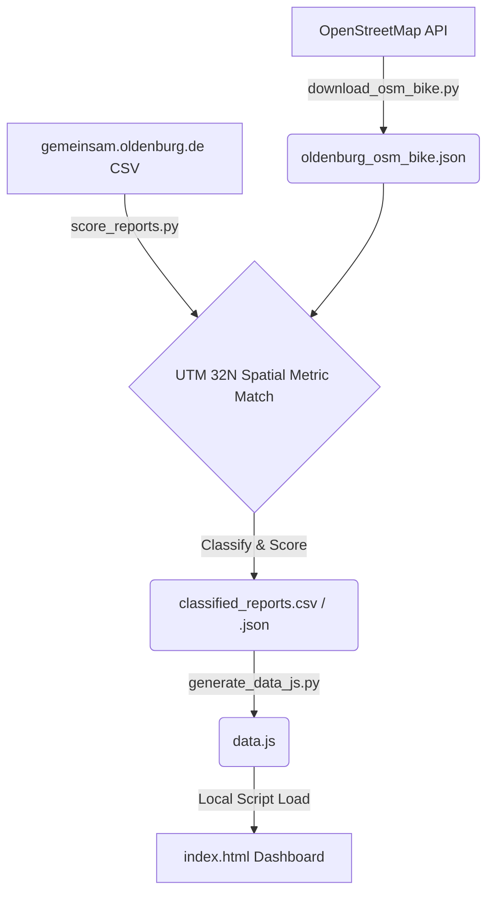

# 🚲 Rad-Verbesserer Oldenburg (Cycling Infrastructure Analyzer)

An interactive dark mode web dashboard and data pipeline that maps, filters, and analyzes citizen infrastructure reports in Oldenburg, Germany against the OpenStreetMap (OSM) cycling network. 

The dashboard provides automated tools for cycling advocacy, including generating weekly newsletter issues (Markdown/HTML) and social media content (Telegram broadcasts, Instagram carousel slide cards).

---

## 🏗️ Architecture & Processing Pipeline

The project follows a 4-step pipeline to extract, project, classify, and visualize the data:



### 1. Cycling Network Extraction
Using the custom Overpass script `download_osm_bike.py`, we extract all cycleways, shared paths, and designated bicycle streets (`bicycle_road=yes`, `cyclestreet=yes`, `highway=cycleway`) within the Oldenburg bounding box.

### 2. High-Precision Coordinate Mapping & Proximity Matching
The raw coordinates in OpenStreetMap and citizen tickets are in degrees (WGS84). Standard distance calculations in degrees are inaccurate. 
* We use `pyproj` to project all coordinates into **UTM Zone 32N (EPSG:32632)**, which provides Cartesian coordinates in **meters**.
* We construct `shapely` `LineString` elements for the cycleways and measure the exact distance in meters from each citizen ticket to the nearest bike segment.

### 3. Confidence Classification Model
Tickets are classified based on their cycling impact into four categories using a point-scoring system (`0` to `100+` points):
* **Keyword Match (+50 pts):** Contains German bike-related keywords (*Radweg*, *Fahrrad*, *Radspur*, *Fahrradstraße*, etc.).
* **Proximity (+10 to +35 pts):** Within 10m (+35), 25m (+20), or 50m (+10).
* **Category Relevance (+10 to +50 pts):** *Fundräder/Abandoned bikes* (+50), *Road/Signs/Lighting/Hedges* (+15), *Fallen trees/branches* (+10).
* **Priority Corridor Bonus (+20 pts):** Located within 50m of an official priority bicycle corridor (e.g. FAST FLIN, Green Wave, Pophankenweg, Ammerländer Heerstraße).
* **Status & Age Adjustments (+10 to -20 pts):** Open/Active (+10), Closed (-20), Not Responsible (-15), Older than 180 days (-10).

#### Classification Tiers:
* 🔴 **Confirmed cycling issue (Score &ge; 70):** Direct path blockages, path potholes, or abandoned bikes on paths.
* 🟠 **Likely cycling issue (Score 40-69):** General defects, foliage, or lights out directly on/near cycle paths.
* 🟡 **Possibly affects cyclists (Score 20-39):** Street-level reports near cycleways that might impede visibility or traffic.
* ⚪ **Not cycling-specific (Score < 20):** General road complaints not directly related to cycling infrastructure.

### 4. Zero-CORS Web Dashboard
`generate_data_js.py` compiles the GeoJSON bike network and classified reports into a single unified JavaScript variable file `data.js`. This allows you to double-click `index.html` and run the dashboard locally in your web browser without encountering CORS (Cross-Origin Resource Sharing) local fetch errors.

---

## 🛠️ Repository File Index

| File | Description |
| :--- | :--- |
| **`index.html`** | Main dashboard structure containing the Leaflet map and Sidebar UI. |
| **`style.css`** | Premium dark mode styling (`#0b0f19`), glassmorphism overlays, custom glowing pins, and swipable card layouts. |
| **`app.js`** | Interactive mapping logic, filter actions, newsletter compilation, and Instagram indicator controller. |
| **`data.js`** | Unified JavaScript file storing the pre-compiled reports and simplified OSM bike network GeoJSON. |
| **`download_osm_bike.py`** | Script to fetch bicycle network geometries from OpenStreetMap Overpass mirrors. |
| **`score_reports.py`** | Core script executing the coordinate projection, distance calculations, and confidence classification. |
| **`generate_data_js.py`** | Pipeline compiler transforming JSON databases into the browser-compatible `data.js` file. |
| **`stadtverbesserer_snapshot.csv`** | Original dataset of 553 citizen reports from the Oldenburg Gemeinsam platform. |
| **`classified_reports.csv`** | Processed spreadsheet output containing coordinates, distances, scores, and confidence classifications. |
| **`agent_handoff.md`** | Handoff documentation designed for future AI agents to continue development of this project. |

---

## 🚀 Setup & Execution Guide

### Prerequisites
Make sure you have `uv` installed, which handles all script dependencies automatically.

### Running the Dashboard
Since all data is embedded inside `data.js`, you can open the dashboard with zero setup:
1. Double-click the **`index.html`** file in your file explorer.
2. Or run a local lightweight server:
   ```bash
   uv run python -m http.server 8000
   ```
   and navigate to `http://localhost:8000` in your web browser.

### Re-running the Data Pipeline
If you update the dataset or want to update the OSM bike network, run:
1. **Download OSM Bike Network:**
   ```bash
   uv run --with requests download_osm_bike.py
   ```
2. **Re-calculate Scores & Classifications:**
   ```bash
   uv run --with pandas --with numpy --with shapely --with pyproj score_reports.py
   ```
3. **Compile Browser Assets:**
   ```bash
   uv run generate_data_js.py
   ```
